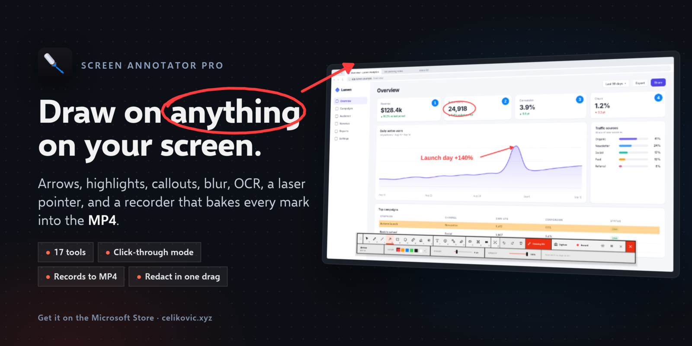
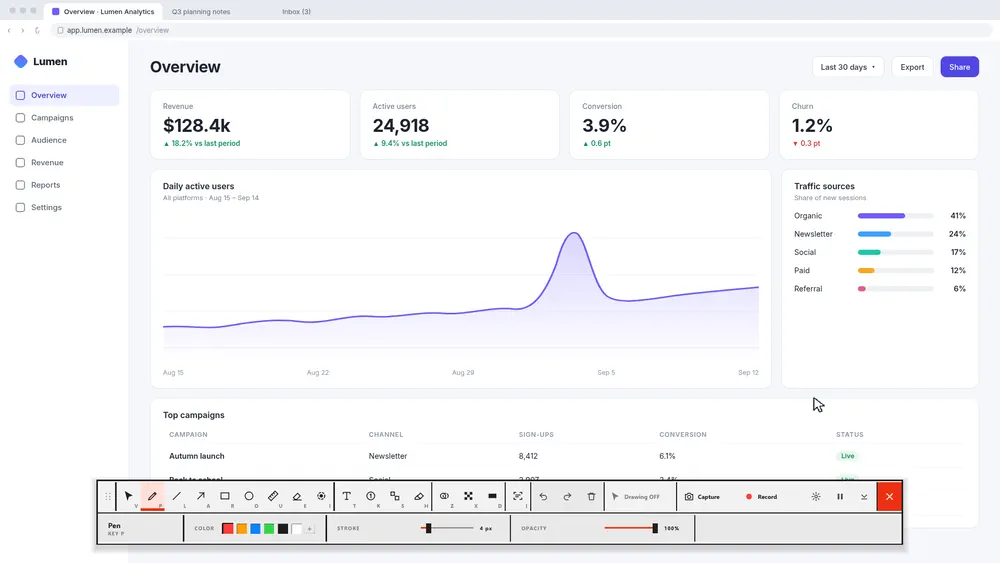
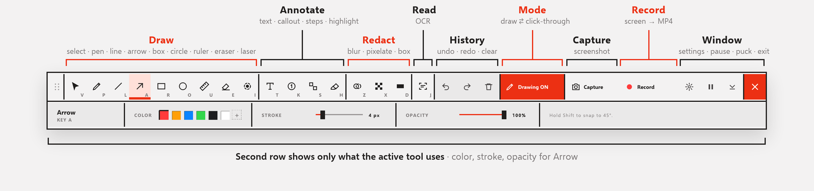
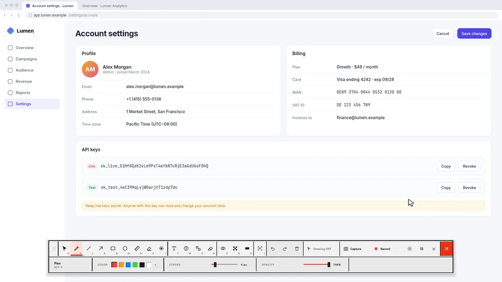
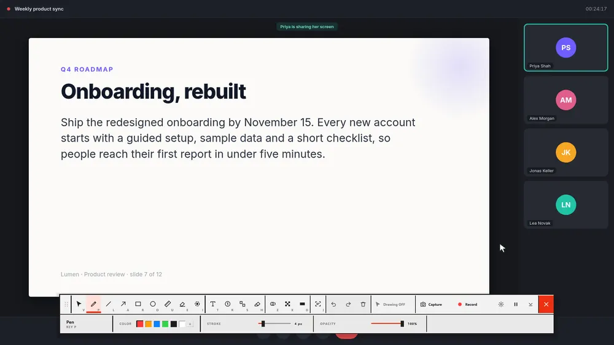
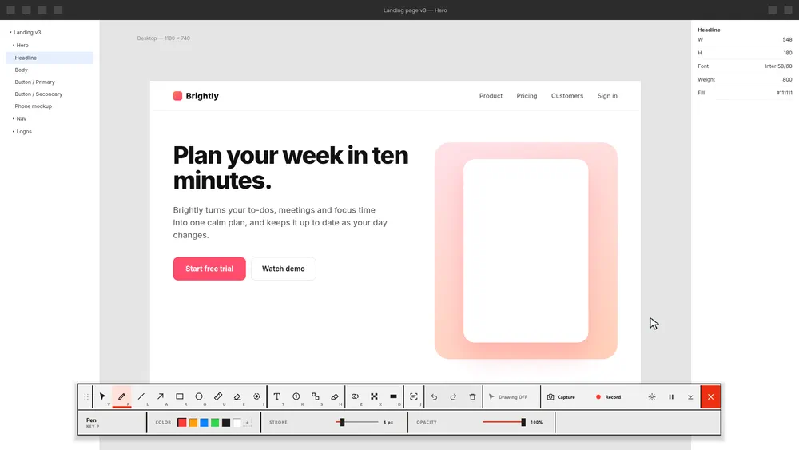
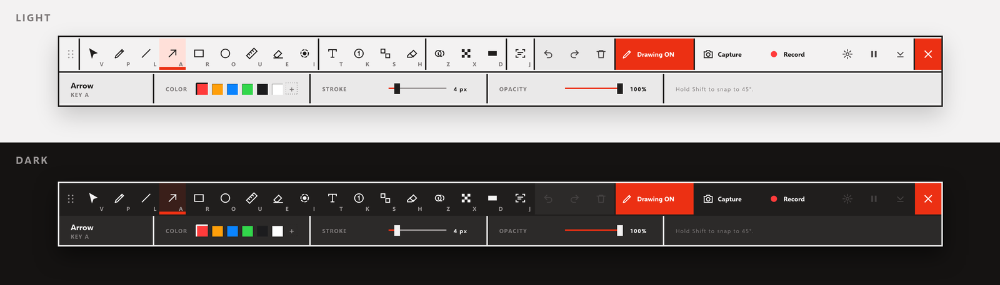

  

  
  
  
  
  

# Screen Annotator Pro

Draw, highlight, annotate, redact, read text off, present and **record**
anything on your screen — live, in real time, without interrupting what's
behind it. A 32 MB download, fully offline, no account.

  

<a href="docs/media/screen-annotator-pro-promo.mp4"><b>▶ Watch the full video (1080p MP4)</b></a> · <a href="https://apps.microsoft.com/detail/9NS87MQB29C7"><b>Get it on the Microsoft Store</b></a> · <a href="https://annotator.pro/"><b>annotator.pro</b></a>

## One dock, 18 tools

A flat dock at the bottom of the screen. The second row only shows what the
tool in your hand actually uses, and every tool has a one-key shortcut.

  

**Click-through mode** is the part that makes it usable live: your marks stay
on screen while the mouse goes back to the app underneath, so you can keep
demoing without the overlay holding your desktop hostage. `Ctrl+Shift+A`
flips between drawing and click-through. Step-by-step:
[how to draw on your screen in Windows 10 and 11](https://annotator.pro/guides/draw-on-screen-windows).

## Edit what you've drawn

Nothing is final. With **Select** (`V`) click a mark to move it, drag its
handles to reshape it — bend an arrow by its middle, point a speech bubble's
tail somewhere else — and change its colour, thickness, fill or opacity from
the dock. Frame several marks to move or restyle them together; `Ctrl+C`,
`Ctrl+V`, `Ctrl+D` copy, paste and duplicate; every change can be undone.

Beyond pen, lines and arrows: **filled** or tinted boxes and circles,
**double and curved arrows**, **speech bubbles**, auto-numbered callouts and
steps, and **stamps** — ✓ ✗ ! ? ★ in one click. Save everything on screen to
a file (`Ctrl+S`) and open it again later (`Ctrl+O`) — handy for the slide
you mark up the same way every week.

With a **pen** (Surface Pen, Wacom, any Windows Ink pen) lines follow the
pressure and the eraser end erases. Or **hold Right Ctrl** to draw for a
moment and let go to be back in your app.

## Redact in one drag

Blur, pixelate or black-box anything before it ends up in a screenshot, a
meeting or a recording. Or press **B**: every email address, phone number,
card number, IBAN, API key and password on the screen is found (offline, with
Windows' own text recognition) and hidden at once — see
[how to blur sensitive info while screen sharing](https://annotator.pro/guides/blur-screen-while-screen-sharing).

  

## Snip & Read

Drag over text you can't select, like a shared screen in a video call, an
image or a scanned PDF, and get it back as real text. Copy it, or send it to
Google Translate in one click. Reading uses the text recognition built into
Windows — offline, instant, in every language you have installed.

  

## Present

- **Whiteboard / blackboard** (`W`) with pages — your desktop marks come back when you leave
- **Spotlight** (`F`), **cursor halo** and **click ripples** — they work while clicks go through to your app, and they're in recordings
- **Show pressed shortcuts** on screen, so viewers can follow along (plain typing is never shown)
- **Magnifier** (`M`) — a loupe beside the cursor, 2×–16×
- **Webcam bubble** — you in a circle on top of everything, in your recordings too
- **Fading ink** — marks that disappear by themselves after a few seconds
- **Hover hints** on every button, and a 3-2-1 countdown before recording

## Record

Press Record and everything on screen goes into an MP4 at full resolution,
your marks included — no second app, no editing afterwards.

- All monitors, one monitor, an area you drag, or **one window** you click
- **Your microphone and your PC's sound**, mixed — the video you're showing, the call, the app you're demoing
- **Trim** it right after (drag the start and end on a timeline), **Make GIF**, or export WebM / a smaller MP4
- **Copy** the finished video or GIF and paste it straight into Teams, Slack, Discord or an email
- Pause and resume; the dock stays out of the frame
- **Recording on the graphics chip** (beta, Settings → Recording): a fraction of the CPU, so less heat, fan and battery, and smooth 4K

## Measure, box and number

A ruler that labels pixel distances, boxes, numbered step markers, a freehand
pen, and undo and redo for all of it.

  

## Light and dark

  

Every animation above is the real app, running from this repo's source: the
dock, the dialogs, the marks and the OCR result are rendered by Screen
Annotator Pro itself. Only the cursor and the captions are added on top, and
the pages being annotated are made-up examples.

## Where the source is

**[`annotateVideo/`](annotateVideo/) is the app.** That's the only folder
that's actively developed, the only one wired into a release pipeline
([`build-video.yml`](.github/workflows/build-video.yml)), and the one that
carries the real Microsoft Store identity
(`Casultra.ScreenAnnotatorPro`, Store ID `9NS87MQB29C7` — see its
[`AppxManifest.xml`](annotateVideo/installer/AppxManifest.xml)). Screen
recording is a feature of this one app, not a separate product — see
[`annotateVideo/README.md`](annotateVideo/README.md) for the full feature
list, hotkeys, and build instructions.

Everything else at the repo root is support material, not app source:

| Path | What it is |
| --- | --- |
| [`annotateVideo/`](annotateVideo/) | **The app.** Live source, builds, and releases. |
| [`archive/`](archive/) | Two frozen snapshots — the app right before and right after recording was added — kept for comparison. Nothing in here is built or maintained going forward; see [`archive/README.md`](archive/README.md). |
| [`docs/`](docs/) | Microsoft Store listing text (`infosMS.md`), release notes for every version ([`docs/release-notes/`](docs/release-notes/)), and the README media in [`docs/media/`](docs/media/) — reference material, not app code. |

## Releases

Every push runs the test suite on real Windows and self-tests the built app.
Tagging `vX.Y.Z` on `main` builds and publishes a GitHub Release with the
portable `.exe`, the `.msi` installer, the sideload
`.msix`, and an unsigned `.msix` for Partner Center, with the notes from
[`docs/release-notes/`](docs/release-notes/). The bundled ffmpeg is built
from source for the app (13 MB instead of 105 MB) by
[`annotateVideo/ffmpeg/build-ffmpeg.sh`](annotateVideo/ffmpeg/build-ffmpeg.sh) — see
[`annotateVideo/README.md`](annotateVideo/README.md#installation) for
details. The Microsoft Store listing itself is a manual Partner Center
submission using that unsigned `.msix`.

## License

MIT — see [`archive/before-recording/installer/License.rtf`](archive/before-recording/installer/License.rtf).

Built on Qt for Python (PySide6, LGPLv3); the full list of open-source parts and their licenses is in [`annotateVideo/THIRD_PARTY_NOTICES.txt`](annotateVideo/THIRD_PARTY_NOTICES.txt).

Copyright © 2025–2026 Anel Celik / Casultra · [celikovic.xyz](https://celikovic.xyz)
